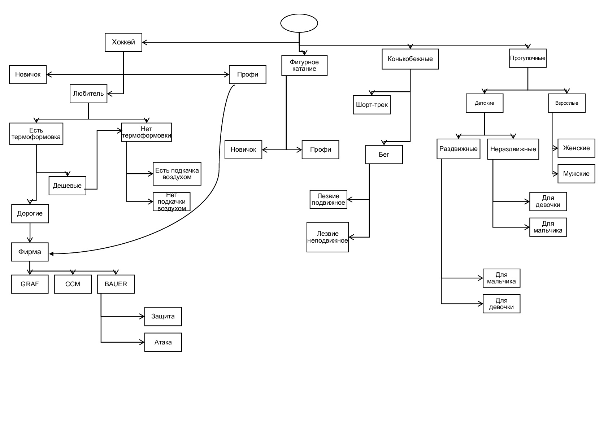

# Отчет по лабораторной работе
## по курсу "Искусственый интеллект"

### Студенты: 

| ФИО       | Роль в проекте                     | Оценка       |
|-----------|------------------------------------|--------------|
| Сахарин | Реализовал оболочку ЭС на Прологе и описал общую схему предметной области |          |
| Сорокин | Написание бота на С# |       |
| Якимович| Тестирование |      |
| Похваленская   | Написание отчёта |          |

## Результат проверки

| Преподаватель     | Дата         |  Оценка       |
|-------------------|--------------|---------------|
| Сошников Д.В. |              |               |

> *Комментарии проверяющих (обратите внимание, что более подробные комментарии возможны непосредственно в репозитории по тексту программы)*

## Тема работы

Для темы нашей лабораторной работы мы решили выбрать реализацию экспертной системы, которая бы позволила помочь пользователю подобрать себе коньки с учетом его пожеланий по виду спорта и уровня подготовки в нем.

## Концептуализация предметной области

Опишите результаты концептуализации предметной области:
 - выделенные понятия
 - связи между ними, тип получившейся онтологии (словарь, сеть, иерархия и т.д.)
 - опишите возможные статические и динамические знания
 - *как предметная область может быть разделена между участниками для коллективного создания базы знаний* Создание базы знаний, по большей части, лежала на Денисе Сорокином, потому что он гораздо точнее разбирается в данной теме, ввиду своих спортивных увлечений. Остальные участники команды имели возможность корректировать базу знаний с позиции рядового пользователя: какие бы параметры выбора казались наиболее полезными при выборе предмета с помощью реализованной экспертной системы.

Приведите графические иллюстрации:

## Принцип реализации системы

Опишите:
 - Какой механизм вывода вы предполагаете использовать и почему
 - Какую систему программирования вы предполагаете использовать и почему
 - Если это имеет смысл, приведите графическую иллюстрацию архитектуры системы. Если система состоит из разных частей (бот, механизм вывода) - опишите принципы интеграции

## Механизм вывода

Опишите, как работает механизм вывода. Наиболее интересные фрагменты кода приведите в отчете.

## Извлечение знаний и база знаний

Опишите, как происходило извлечение знаний, с учётом совместной работы над проектом. Приведите фрагменты представления знаний: дерево И-ИЛИ, наиболее интересные правила. 

## Протокол работы системы

Приведите несколько примеров работы системы, проиллюстрируйте их фрагментами деревьев вывода.

## Выводы

В ходе проделанной лаборатной работы мы получили новые и подкрепили уже имеющиеся навыки. Хочется, в первую очередь, отметить, что для каждого из нашей команды это был первый опыт создания экспертной систему. Так что полученные новые знания, несомненно, пригодятся в будущем, потому что, очевидно, что подобные задачи становятся все более и более актуальными. ....

Сформулируйте *содержательные* выводы по лабораторной работе. Чему он вас научила? 
Над чем заставила задуматься? В чём состояли основные сложности в работе? Насколько эффективной получилась командная работа, и какие методы для повышения эффективности командной работы вы использовали (scrum, slack, ...)?

Помните, что несодержательные выводы -
самая частая причина снижения оценки.
